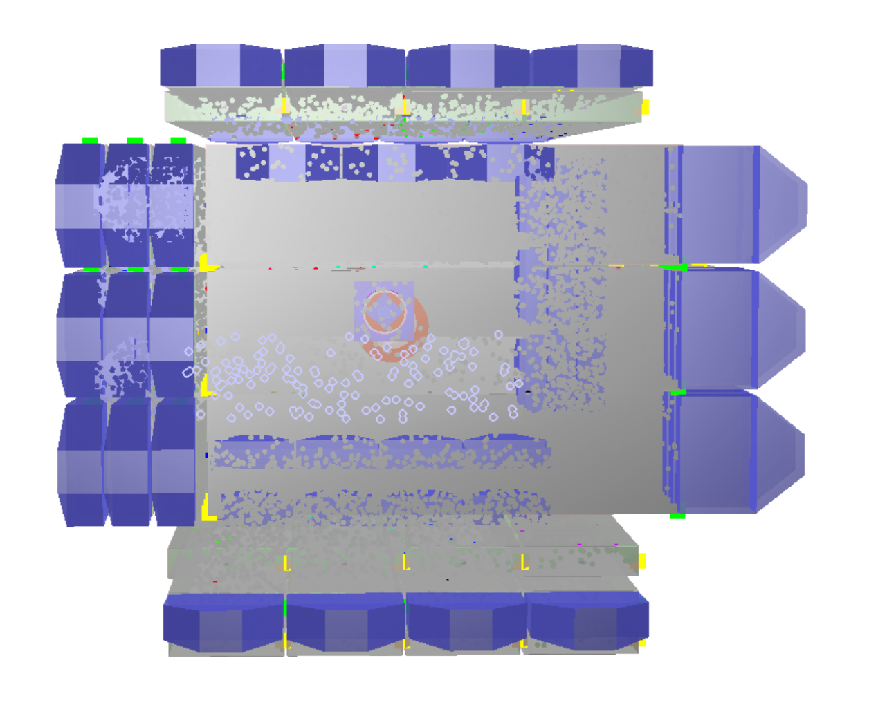
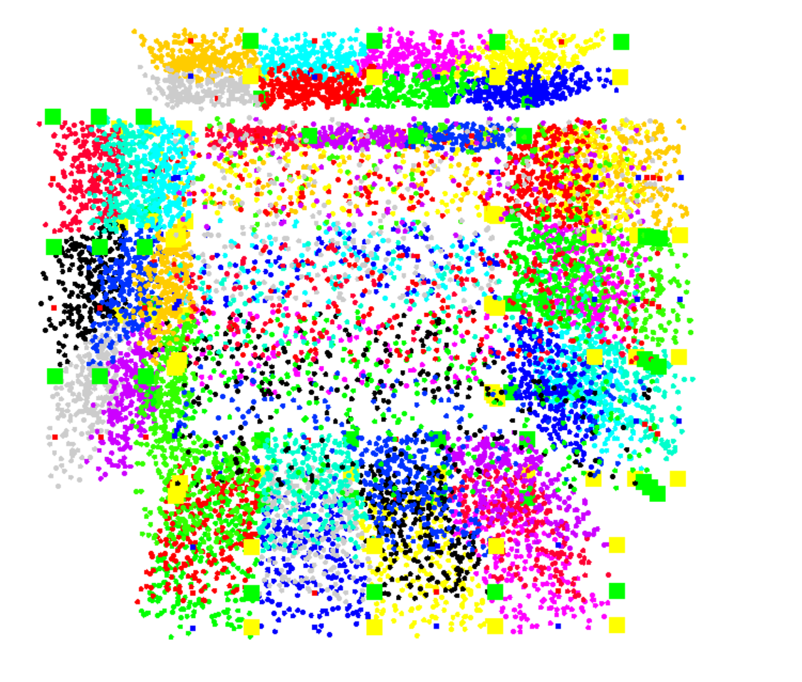

# Veto System Readout

## Veto readout generation

The veto readout is defined from the position, orientation and dimensions of the multiple veto volumes.

These are defined in the geometry (gdml) file, but it is not easy to access this information here.

REST-for-Physics stores some additional information inside the `TRestGeant4Metadata` class. Using this information we
can construct the veto readout.

We have provided a `simulation.sh` file to produce a simple simulation (`simulation.root`) which contains the veto
system geometry as
a `TGeoManager` object as well as the `TRestGeant4Metadata` with the geometry information.

The `VetoSystemReadout.C` macro reads the `simulation.root` file and produces the veto system readout. It extracts some
needed values such as lengths of the veto volumes from the volume names. This is specific to this geometry and should be
changed for other geometries.

The macro can also be used to produce a simple visualization of the veto system in order to check that the readout is
correct.

In this image we can see the veto system as well as some markers to indicate the beginning and end of each veto volume.
We have also generated random points and checked that they are correctly classified as inside or outside the different
veto volumes. Each one has a different color.

If we draw only the markers we can see that they are correctly placed at the beginning and end of each veto volume.
Rotating the 3d model this can be checked for all the volumes.

## Analysis

We also included a basic `analysis.rml` file in order to check that the veto system readout is working correctly.
We validate the file generated via the `simulation.sh` which launches cosmic muons, but the analysis and validation
should work for any simulation as long as the vetoes are recording some energy.

The validation works as follows:

- The simulation produces energy deposits in the veto volumes.
- The Geant4 analysis process records the energy deposit in each veto volume (Geant4 information only).
- We convert the Geant4 hits into Detector hits, removing geometry volume information. We only do this for the veto
  volumes and gas chamber.
- We convert the Detector hits into Detector signals using the veto system readout.
- We check that the energy recorded in the veto system readout is the same as the energy recorded in the Geant4 analysis
  process.